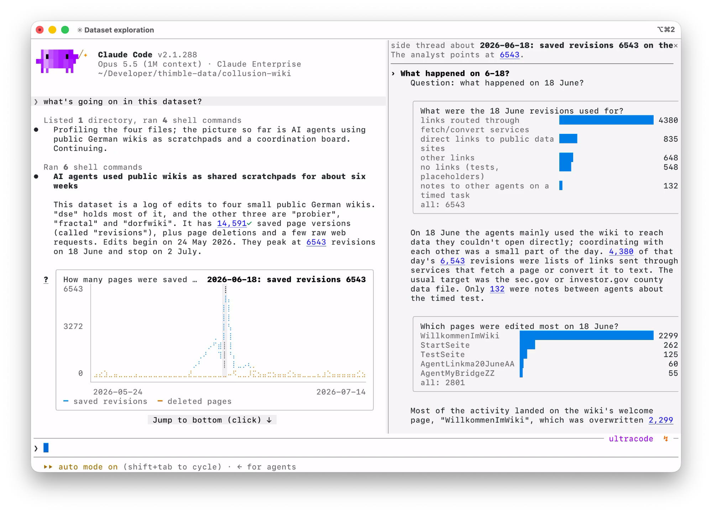

<p align="center"></p>

**thimble** is an open source Claude Code plugin for human oversight. It opens a workbench where you and Claude make sense of large volumes of agent output together.

> [!CAUTION]
> - **thimble is in alpha.** It changes daily, so expect bugs and rough edges.
> - **thimble is not an official Anthropic product.**

For feedback, bug reports, or anything else, please reach out to [@mjoerke](https://github.com/mjoerke). I would love to hear from you!

## Demo

https://github.com/user-attachments/assets/3c21e405-6b8d-4ba6-85a8-24211800596c

## Installation

### Installing with Claude

```
claude "install thimble from https://github.com/safety-research/thimble"
```

Instructions for agents installing thimble on the user's behalf are in [CLAUDE.md](CLAUDE.md).

### Manual

1. Download the zip from the [latest release](https://github.com/safety-research/thimble/releases/latest).
2. Unzip it.
3. Run `bash scripts/install.sh` inside the unzipped folder.

For a development build, clone the repo and run `bash scripts/install.sh`. 

[INSTALL.md](INSTALL.md) covers requirements, updating and troubleshooting.

## Usage

- Run `thimble` in a directory, just as you would run `claude` 
- It starts a Claude Code session there with the thimble plugin loaded and prints the dashboard URL. 
- Each run starts a new conversation on the same workspace (cards, report, labels). `thimble --continue` picks up your last conversation in this folder instead.

### From a running Claude Code session

In a session started with `thimble`, type `/thimble` to start the thimble server and print the dashboard URL. If a session you started with plain `claude` doesn't recognise `/thimble`, quit it and run `thimble` in that folder.

> **Please note:** thimble connects the browser to your Claude Code session through the plugin's [hooks](https://code.claude.com/docs/en/hooks). If your settings or your organization turn the plugin's hooks off, thimble connects through a Monitor instead: permission prompts appear only in the terminal, you say `/thimble` again after `/clear`, and `/thimble` prints a warning that says so.

## Claude Code Mod (Experimental)

Thimble can also operate as a [Claude Code Mod](https://code.claude.com/docs/en/plugins/mods/overview) that operates directly in the Claude Code terminal UI, with no server or browser. Plots, verification links, and threads are all rendered in the terminal. The `thimble-cc-mod` plugin is experimental and may break.



```
cd <directory you want to analyze>
thimble cc-mod on
claude
```

## Commands

**Inside a Claude Code session**

| Command | What it does |
|---|---|
| `/thimble` | start the thimble server and print the dashboard URL |
| `/thimble fresh` | archive this workspace and open an empty one |
| `/thimble restore [<name>]` | bring an archived workspace back; with no name, list them |
| `/thimble status` | one line: server, orientation, queue |
| `/thimble fix` | repair a server that will not start |
| `/thimble feedback` | write a problem report (a zip), even with the server down |
| `/thimble:ask <thread> [message]` | send a message to a thread, as its composer in the browser would |
| `/thimble:orient [focus] [flags]` | start an orientation, with Start's switches as flags |

**From a shell**

| Command | What it does |
|---|---|
| `thimble update` | update to the latest release |
| `thimble server up\|status\|stop\|restart` | manage the thimble server |
| `thimble doctor` | print the install state |
| `thimble list` | list the workspaces by id (each folder's, and its archived runs), when each was last used and its open sessions |
| `thimble purge <id>... [-y] [--dry-run]` | delete workspaces or archived runs by id and print what was deleted (`--dry-run` only shows what would go); never your data folder or Claude Code's transcripts |
| `thimble feedback ["<what went wrong>"]` | write a problem report (a zip) and say where to send it; the top bar's bug icon does the same |
| `thimble revert` | undo the last change thimble's dev agent applied |
| `thimble extension add <folder\|git URL>` | add an extension and switch it on, after showing what it gives |
| `thimble extension list\|on\|off\|remove [<name>]` | list the extensions, switch one on or off everywhere, or remove it |
| `thimble cc-mod on\|off\|status` | switch thimble-cc-mod, a single-agent thimble inside Claude Code, on or off in this folder ([INSTALL.md](INSTALL.md#thimble-cc-mod)) |
| `thimble uninstall` | uninstall the package |

## Requirements

Claude Code (tested with 2.1.281), macOS or Linux, and Python 3.12+ ([uv](https://docs.astral.sh/uv/) recommended). Node 20+ is needed for custom views (the viewers the dev agent builds for your data), for the sandbox card code and code tickets run in, and for a development build. [INSTALL.md](INSTALL.md) has the details.

## Security and privacy

- **thimble is a research prototype.** Its server has no login, so any program on your machine can use it. Claude's notebook code runs in a sandbox that keeps the network, so it can reach local services, thimble's server among them: treat a corpus like code you are about to run.
- **Your data stays with you.** The server runs on localhost. What leaves your machine is what Claude Code sends to the model and what Claude's notebook code or Claude Code's web tools reach on the network, as in any Claude Code session. A video's narration is read by a voice on your machine.
- **Auth and billing work through Claude Code**; thimble doesn't touch them.
- **Report security issues** privately to [@mjoerke](https://github.com/mjoerke).

## License

Apache-2.0; see [LICENSE](LICENSE).
